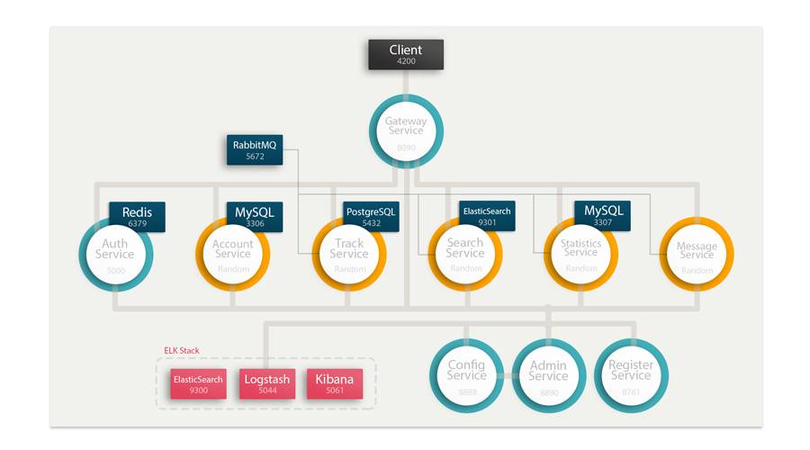
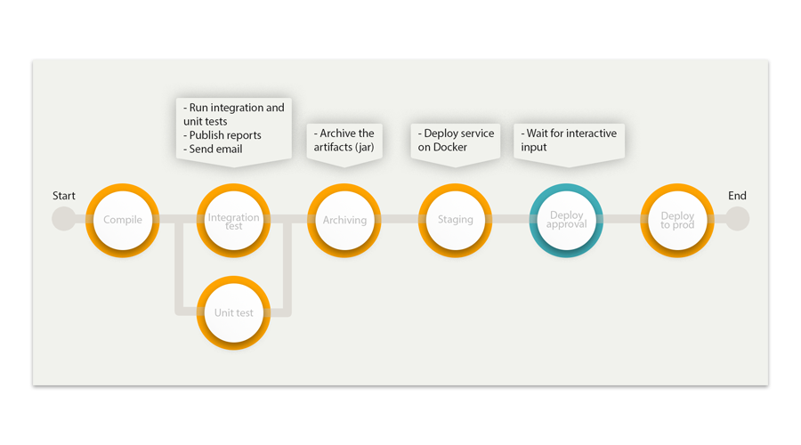

# Trk - Spring Cloud Example Project
An example project that demonstrates how to build a microservice-oriented application using Spring Boot, Spring Cloud, Docker and Angular.

## Demo

Watch this video to see it in action: [Spring Cloud Example Project with Angular](https://www.youtube.com/watch?v=Zd_8ZA15q_8)

## Demonstrated concepts and technology list

#### Demonstrated concepts - backend:
* Microservice architecture
* Service discovery
* Event-driven Architecture
* Centralized configuration
* Centralized log management

#### Technology list - backend:
* Spring Cloud Gateway
* Spring Cloud Config
* Spring Cloud Netflix
* Spring Data Elasticsearch
* Spring Boot Web Socket
* Spring Boot
* RabbitMQ
* Docker
* Redis
* Elk 
* Testcontainers
* Hibernate Spatial
* PostgreSQL + PostGIS
* MySQL
* Jenkins

#### Demonstrated concepts - frontend:
* Single-page application (SPA) approach
* Lazy Loading Feature Modules

#### Technology list - frontend:
* Angular 6
* Angular Material 6
* Stompjs
* Sockjs
* Leaflet
* Ngx-leaflet
* RxJs

## Architecture Overview

   
## Services
### Functional services
Service   | Port	| Description	
------------- | ------------------------- | ------------------------- 
Account Service	| Random (0)   | Provides API to get all details of the currently logged in user.
Track Service	| Random (0)   | Provides API for managing, starting, stopping tracks and contains a fake client to simulate driving a route.
Statistics Service	| Random (0)   | Performs calculations on tracks. 
Search Service	| Random (0)   | Join track and statistic data and provides API for searching in them. 
Message Service	| Random (0)   | Provides a WebSocket-style messaging.

### Infrastructure services
Service   | Port	| Description	
------------- | ------------------------- | ------------------------- 
Auth Service	| 5000   | Provides OAuth2 tokens for the backend resource services and it is used for secure server-to-server communication between microservices.
Config Service	| 8888   | Provides an centralized configuration.
Admin Service	| 8890   | Used for managing and monitoring services.
Register Service	| 8761   | It allows automatic detection of network locations for service instances.
Gateway Service	| 8090   | Gateway service uses Spring Cloud Gateway to route requests to multiple services using a single entry point. Spring Cloud Gateway is necessary because Zuul doesn't support web-socket.

## Log
Centralized logging can be very useful when attempting to identify problems with your servers or applications, as it allows you to search through all of your logs in a single place. This project use ELK stack for searching, analyzing, and visualizing log data in real-time. Each service use Logback logging frameworks to send log data to Logstash. 

## Infrastructure automation
Continuous integration and continuous delivery (CI/CD) are a key requirement for achieving success with microservices. 
Here is a simple Continuous Delivery workflow, implemented in this project:

## How to run all the things?

### External services

#### Before you start
* Install Docker and Docker Compose.
* Install gradle

This application depends on external services that must be up and running before attempting to run the application.  
To start all external services run `gradle dockerComposeUp` or start the containers manually with `docker-compose up`.

### Services
All Spring Boot applications require already running Config Server for startup. Also, all operations from Eureka client may take some time to reflect in the Eureka servers and subsequently in other Eureka clients. This is because of the caching of the payload on the eureka server which is refreshed periodically to reflect new information.
#### Starting order:
1. Config Server
2. Register Service  
Gateway Service  
Admin Service  
Auth Service  
Account Service  
Statistics Service  
Search Service  
Message Service  
Track Service  

### Client
Before you start client, make sure you have Node.js and npm installed.
#### To start client:
1. `npm install`
2. `ng serve` or `npm start`